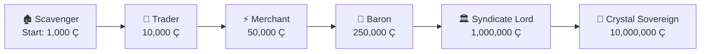
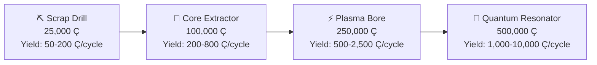
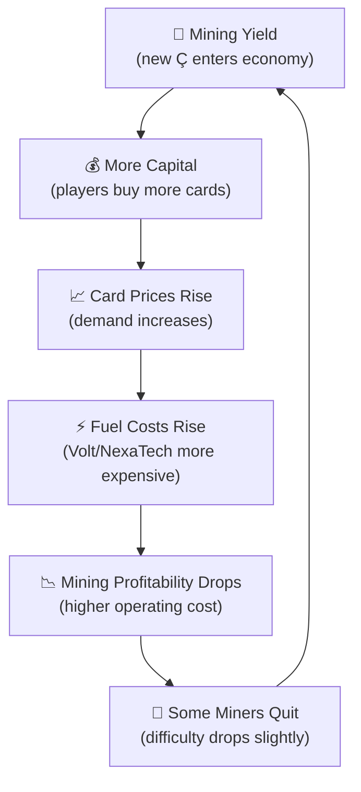
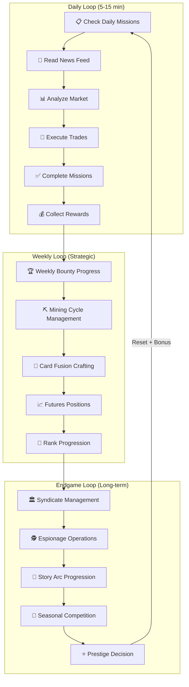
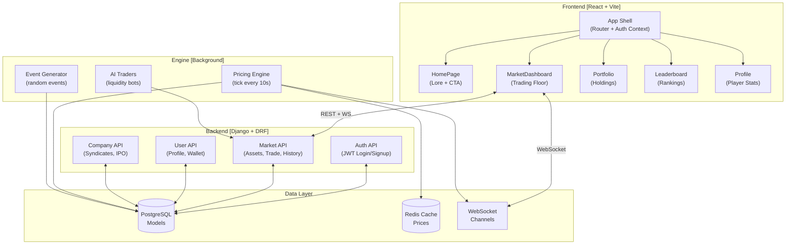
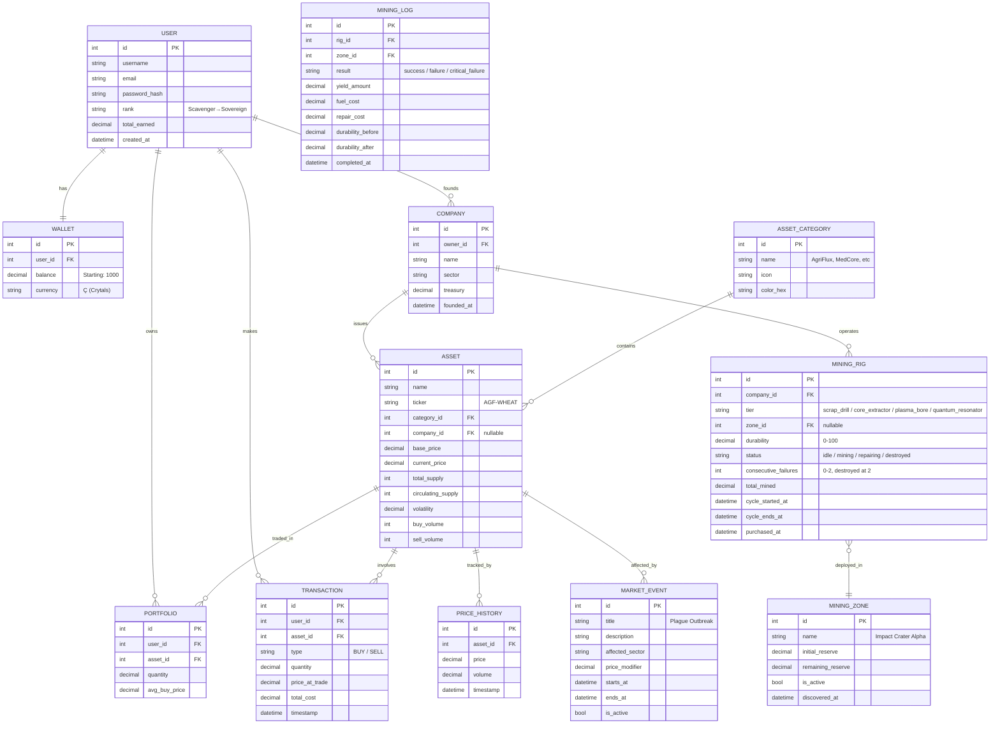

# CRYTX — Game-Driven Trading Platform
## Comprehensive Strategy & Implementation Blueprint

---

## 1. Executive Vision

CRYTX is a **narrative-driven economic simulation** disguised as a trading platform. Players inhabit a post-apocalyptic world where humanity's last hope — mysterious **Crytals** — fuel a new civilization. The platform blends:

| DNA Strand | Inspiration |
|---|---|
| **Futuristic Stock Exchange** | Bloomberg Terminal, TradingView |
| **Cyberpunk Strategy Game** | Cyberpunk 2077 UI, Deus Ex HUD |
| **Economic Simulator** | EVE Online Market, Capitalism Lab |
| **Competitive Marketplace** | Fantasy stock leagues, crypto exchanges |

The result: a **dark, immersive, holographic trading floor** where every buy/sell decision is a strategic move in a living, breathing economy.

---

## 2. Core Game Mechanics

### 2.1 The Card-Based Trading System

Each tradeable asset is represented as a **Crytal Card** — a visually stunning, holographic card with dynamic stats. Cards belong to **Sectors** (categories):

| Sector | Ticker Prefix | Example Cards | Lore |
|---|---|---|---|
| 🌾 **AgriFlux** | `AGF` | Wheat, Water, Seeds | Controls the food supply chain |
| 💊 **MedCore** | `MED` | Serum, MedKits, BioFilters | Monopoly on medical resources |
| ⚡ **Volt** | `VLT` | Battery, Reactor, Solar Cells | Energy syndicate |
| 🔫 **Arsenal** | `ARS` | Ammo, Shields, Drones | Military-industrial complex |
| 🔧 **NexaTech** | `NXT` | Chips, AI Cores, Quantum Nodes | Advanced technology |
| 🏗️ **Ironworks** | `IRN` | Steel, Concrete, Nanomesh | Infrastructure builders |

> [!IMPORTANT]
> Each card has dynamic attributes: **Base Price**, **Current Price**, **Volatility Index**, **Supply**, **Demand Score**, and a **Sector Health** indicator.

### 2.2 Dynamic Pricing Engine

Prices are **not static**. A background simulation engine recalculates prices every 10 seconds based on:

```
NewPrice = BasePrice × DemandMultiplier × EventModifier × VolatilityNoise
```

| Factor | Description |
|---|---|
| **Demand Multiplier** | `buy_volume / sell_volume` ratio — heavy buying drives price up |
| **Event Modifier** | Global events (asteroid storms, faction wars) multiply sector prices |
| **Volatility Noise** | Random ±2-5% jitter to simulate market chaos |
| **Supply Decay** | Scarce assets naturally appreciate over time |
| **Slippage** | Large trades move the price more than small ones |

### 2.3 Player Progression System



| Tier | Threshold | Unlocks |
|---|---|---|
| **Scavenger** | 0 Ç | Basic market access, 3 sectors |
| **Trader** | 10,000 Ç | All 6 sectors, price alerts |
| **Merchant** | 50,000 Ç | Limit orders, margin trading |
| **Baron** | 250,000 Ç | Create custom cards, issue assets |
| **Syndicate Lord** | 1,000,000 Ç | Found a corporation, hire AI traders |
| **Crystal Sovereign** | 10,000,000 Ç | Control events, manipulate markets |

### 2.4 Global Events System

Random events inject chaos into the economy every 2-5 minutes:

| Event | Affected Sector | Effect |
|---|---|---|
| 🌪️ Asteroid Storm | All | +15% volatility globally |
| 🦠 Plague Outbreak | MedCore | +40% demand, price surge |
| ⚡ Power Grid Collapse | Volt | -30% supply, price spike |
| 🏴 Faction War | Arsenal | +60% demand for weapons |
| 🌾 Harvest Failure | AgriFlux | Food prices double |
| 🔧 Tech Breakthrough | NexaTech | New card unlocked, prices drop 20% |

### 2.5 Syndicate (Corporation) System

Once players reach **Baron** tier, they can:
- **Found a Corporation** — name it, brand it, choose a sector focus
- **Issue Custom Cards** — IPO-style asset issuance
- **Hire AI Traders** — automated bots that trade on your behalf
- **Form Alliances** — syndicate-to-syndicate trade agreements
- **Control Territory** — dominate a sector for tax revenue

### 2.6 Crytal Mining System

Mining is the **endgame economic engine** — the only way to inject *new* Crytals (Ç) into the economy beyond the initial starting capital. But it's deliberately **hard, expensive, and risky**.

#### Core Concept

The asteroid didn't just give humanity Crytals on a platter. The raw crystal veins are buried deep in irradiated impact zones. Extracting them requires:
- **Massive capital** — Mining rigs are expensive to build and operate
- **Resource consumption** — Rigs burn through Volt (energy) and NexaTech (tech) cards as fuel
- **Time commitment** — Mining cycles take hours, not seconds
- **Luck** — Yield is probabilistic, not guaranteed
- **Risk** — Rigs can malfunction, get sabotaged, or hit dead veins

#### Who Can Mine?

| Requirement | Details |
|---|---|
| **Minimum Rank** | Baron (250,000 Ç net worth) |
| **Must Own** | A registered Company/Syndicate |
| **Rig Purchase** | Costs 25,000 - 500,000 Ç per rig |
| **Fuel Required** | Volt + NexaTech cards consumed per cycle |

#### Mining Rig Tiers



| Rig Tier | Cost | Cycle Time | Base Yield Range | Fuel per Cycle | Failure Rate |
|---|---|---|---|---|---|
| ⛏️ Scrap Drill | 25,000 Ç | 4 hours | 50 - 200 Ç | 2 Volt + 1 NexaTech | 5% |
| 🔧 Core Extractor | 100,000 Ç | 6 hours | 200 - 800 Ç | 5 Volt + 3 NexaTech | 10% |
| ⚡ Plasma Bore | 250,000 Ç | 8 hours | 500 - 2,500 Ç | 10 Volt + 5 NexaTech | 18% |
| 💎 Quantum Resonator | 500,000 Ç | 12 hours | 1,000 - 10,000 Ç | 20 Volt + 10 NexaTech | 25% |

> [!WARNING]
> **Failure doesn't just mean zero yield** — on a critical failure (rolled within the failure rate), the rig takes **damage** and requires repair costs (10-30% of rig value). Two consecutive failures **destroy** the rig entirely.

#### Difficulty Scaling (The Hard Part)

This is what prevents mining from being a free money machine. Difficulty scales on **three axes**:

**1. Network Difficulty (Global)**
```
Difficulty = BaseDifficulty × (1 + TotalActiveRigs / 50) × (1 + TotalMinedAllTime / 1,000,000)
```
- The more rigs running across ALL players, the harder it gets for everyone
- The more total Crytals that have been mined historically, the scarcer the remaining veins
- This mirrors Bitcoin's difficulty adjustment — early miners get rich, late miners struggle

**2. Vein Depletion (Per-Zone)**
- The mining map has **zones** (Impact Crater Alpha, Beta, Gamma, etc.)
- Each zone has a finite Crytal reserve (e.g., 5,000,000 Ç total)
- As players mine a zone, yield decreases logarithmically:
```
ActualYield = BaseYield × ln(RemainingReserve) / ln(InitialReserve)
```
- When a zone depletes below 10%, it enters "Dead Vein" status — near-zero yield
- New zones unlock periodically (simulating new asteroid fragment discoveries)

**3. Operational Decay (Per-Rig)**
- Every rig has a **Durability** stat (starts at 100%)
- Each mining cycle reduces durability by 3-8%
- Lower durability = lower yield multiplier AND higher failure rate:
```
YieldMultiplier = Durability / 100
AdjustedFailureRate = BaseFailureRate × (2 - Durability/100)
```
- Repair costs: `RigCost × (100 - Durability) / 100 × 0.3`
- At 0% durability, the rig is scrap — must buy a new one

#### AI Auto-Miners

Players at **Syndicate Lord** tier can assign AI traders to automate mining operations:

| Feature | Details |
|---|---|
| **Auto-Fuel Purchase** | AI buys Volt + NexaTech cards from market to fuel rigs |
| **Smart Zone Selection** | AI picks the least-depleted zone |
| **Auto-Repair** | AI repairs rigs when durability drops below threshold |
| **Cost** | 5% of mining yield goes to "AI operational fee" (burned from economy) |

> [!IMPORTANT]
> **The AI auto-miner doesn't make mining easier — it just makes it hands-off.** The player still needs the capital, the rig, and the fuel. The AI simply automates the cycle execution. And the 5% fee acts as a **Crytal sink** to prevent inflation.

#### Economic Balance: Why Mining Doesn't Break the Game

| Mechanism | How It Prevents Abuse |
|---|---|
| **High Entry Barrier** | 250K net worth + company + rig purchase |
| **Resource Consumption** | Mining *consumes* tradeable cards, removing supply → prices rise |
| **Diminishing Returns** | Network difficulty + vein depletion = less yield over time |
| **Failure Risk** | 5-25% chance of damage per cycle, potential rig destruction |
| **Durability Decay** | Continuous maintenance cost |
| **AI Fee Sink** | 5% of auto-mined yield is permanently burned |
| **Time Gates** | 4-12 hour cycles prevent rapid extraction |
| **Zone Limits** | Finite reserves per zone, no infinite mining |

The net effect: Mining adds Crytals to the economy **slowly and expensively**, while simultaneously **removing cards from circulation** (fuel consumption). This creates a self-balancing economic loop:



#### Mining UI Concept

A dedicated **"Mining Operations"** page accessible from the navbar (Baron+ only):
- **Mining Map**: Visual grid showing zones with depletion levels (heat map)
- **Rig Dashboard**: Cards showing each owned rig — durability bar, cycle progress, yield history
- **Deploy Rig**: Drag-and-drop rig onto a zone to start mining
- **Fuel Gauge**: Shows required Volt/NexaTech cards and current inventory
- **Mining Log**: Terminal-style scrolling log of cycle results
- **Network Stats**: Global difficulty indicator, total active rigs, total mined

### 2.7 Mission & Story Arc System

A trading platform without *purpose* is just a spreadsheet. The lore is incredible — but players need to **live** it, not just read it.

#### Story Arcs (Main Questline)

The player doesn't just trade randomly. They're recruited by a mysterious figure called **The Broker** who guides them through the post-apocalyptic economy. Each arc unlocks at a rank threshold and tells a chapter of the CRYTX world:

| Arc | Unlocks At | Story | Mechanical Reward |
|---|---|---|---|
| **Ch.1: The First Trade** | Scavenger | The Broker teaches you survival economics | Tutorial completion + 500 Ç bonus |
| **Ch.2: Blood in the Water** | Trader | A cartel is manipulating AgriFlux prices — investigate | Unlock price alerts + insider intel |
| **Ch.3: The Syndicate Wars** | Merchant | Two factions are at war — pick a side | Faction alignment + exclusive cards |
| **Ch.4: Deep Vein** | Baron | Discover a hidden mining zone before others | Early access to richest zone |
| **Ch.5: Corporate Espionage** | Syndicate Lord | Infiltrate a rival corporation | Unlock espionage mechanics |
| **Ch.6: The Crystal Throne** | Crystal Sovereign | Control the global economy or liberate it | Endgame prestige title |

#### Daily Missions (Retention Engine)

Every 24 hours, players receive 3 randomized missions:

| Mission Type | Example | Reward |
|---|---|---|
| **Trade Volume** | "Execute 5 trades in the MedCore sector" | 200 Ç |
| **Profit Target** | "Earn 1,000 Ç profit today" | Rare card fragment |
| **Market Timing** | "Buy an asset below 50% of its ATH" | XP bonus |
| **Sector Scout** | "Hold at least 1 card from every sector" | Diversification badge |
| **Contrarian** | "Buy an asset that dropped 20%+ today" | Risk-taker title |

#### Weekly Bounties (Competitive)

Global challenges visible to all players:

| Bounty | Goal | Prize |
|---|---|---|
| **Wolf of CRYTX** | Highest trading volume this week | 5,000 Ç + leaderboard crown |
| **Diamond Hands** | Largest unrealized portfolio gain | Exclusive holographic card |
| **The Vulture** | Best profit from buying crashed assets | Title + prestige XP |

### 2.8 Black Market (Underground Economy)

Every dystopian world needs a shadow economy. The **Black Market** is an unlockable, high-risk/high-reward trading layer.

#### How It Works

- Unlocks at **Merchant** rank (50,000 Ç net worth)
- Accessed via a hidden nav link ("///DARKNET" glitch text)
- Trades here are **anonymous** — no transaction history visible to others
- **No price charts** — you trade blind, based on rumors and intel
- **Tax-free** — but if you're "caught" (random audit event), you pay a 30% penalty

#### Contraband Cards

Special cards only available on the Black Market:

| Card | Sector | Effect | Risk |
|---|---|---|---|
| 🧬 **Mutagen Serum** | MedCore | 2x yield on next mining cycle | 15% chance of rig damage |
| 💣 **EMP Device** | Arsenal | Sabotage a rival's mining rig | If traced, lose 10,000 Ç fine |
| 🔑 **Access Key** | NexaTech | Unlock a hidden mining zone early | One-time use |
| 🛢️ **Synth Fuel** | Volt | Halves mining cycle time once | Causes 20% extra durability decay |
| 📡 **Intel Package** | NexaTech | Reveals next 3 market events | Expires in 1 hour |

#### Audit System

- Every Black Market trade has a **5% audit chance**
- If audited: 30% of the trade value is seized as a fine
- 3 audits in a week = **temporary ban from Black Market** (48 hours)
- Creates genuine tension: the deals are amazing, but the risk is real

### 2.9 CRYTX News Network (CNN — Crytal News Network)

A **live, lore-driven news feed** that doubles as market intelligence. This isn't a boring event log — it's a fully immersive propaganda/journalism experience.

#### News Types

| Type | Visual Style | Example | Market Impact |
|---|---|---|---|
| 📰 **Breaking News** | Red banner, urgent tone | "PLAGUE OUTBREAK IN SECTOR 7" | MedCore +40% |
| 📊 **Market Analysis** | Bloomberg-style data panel | "AgriFlux showing bearish divergence" | Subtle hint |
| 🎤 **Interview** | Character portrait + quote | "Baron Kael: 'Volt will rule'" | Sentiment shift |
| 🔒 **Classified Intel** | Redacted text, decrypt cost | "[REDACTED] shipment arriving in ██ hours" | Paid advantage |
| 📡 **Rumor Mill** | Glitchy, uncertain text | "Whispers of new mining zone..." | Speculative |
| ⚠️ **Government Decree** | Official seal styling | "Trading tax increased to 2%" | Global mechanic change |

#### Implementation

- Auto-generated from the Event System + curated templates
- Scrolls as a **ticker bar** at the top of the MarketDashboard
- Full news page with archive, search, and category filters
- **Classified Intel** costs 500 Ç to decrypt — but gives 15-minute advance warning of events

### 2.10 Card Fusion & Crafting

Lower-tier cards can be **fused** into higher-value composite cards. This adds a collectible/crafting layer on top of pure trading.

#### Fusion Recipes

| Input Cards | Output | Effect |
|---|---|---|
| 3× AgriFlux Wheat + 2× Volt Battery | 🌟 **HydroFarm Module** | Self-sustaining food + energy card, rare |
| 2× MedCore Serum + 1× NexaTech Chip | 🌟 **BioSync Implant** | Premium medical tech, high base price |
| 5× Any same-sector common | 🌟 **Sector Mastercard** | Earns passive 0.5% daily yield |
| 1× of each sector (6 total) | 💎 **Crytal Prism** | Legendary card, gains value from ALL sectors |

#### Mechanics

- Fusing **destroys** the input cards (deflationary pressure)
- Fused cards have a **rarity glow** (Common → Rare → Epic → Legendary)
- Legendary cards appear on the leaderboard
- Some fusion recipes are **hidden** — discoverable through experimentation or intel

### 2.11 Contracts & Futures

Advanced financial instruments for experienced players:

#### Futures Contracts

| Feature | Details |
|---|---|
| **What** | Agree to buy/sell an asset at a fixed price on a future date |
| **Expiry** | 1 hour, 6 hours, 24 hours, or 7 days |
| **Margin** | Must deposit 20% of contract value as collateral |
| **Settlement** | Auto-executes at expiry — profit or loss based on price difference |
| **Liquidation** | If unrealized loss exceeds 80% of margin, position is force-closed |

#### Limit Orders & Stop-Loss

| Order Type | Description |
|---|---|
| **Limit Buy** | Buy when price drops to target |
| **Limit Sell** | Sell when price rises to target |
| **Stop-Loss** | Auto-sell if price drops below threshold |
| **Take-Profit** | Auto-sell if price rises above threshold |

> [!NOTE]
> Futures unlock at **Merchant** rank. They're powerful but risky — you can lose your margin entirely if the market moves against you.

### 2.12 Reputation & Faction System

Players aren't just traders — they have a **reputation** that affects how the world treats them.

#### Reputation Score (-100 to +100)

| Range | Title | Effects |
|---|---|---|
| -100 to -50 | 🔴 **Outlaw** | Black Market discounts, but +10% regular trade tax |
| -49 to -1 | 🟠 **Shady** | Minor distrust, some shops refuse service |
| 0 to 49 | 🟡 **Neutral** | Standard rates |
| 50 to 79 | 🟢 **Trusted** | 5% trade fee discount, better loan rates |
| 80 to 100 | 🔵 **Legendary** | Exclusive cards, VIP market access, title |

#### What Affects Reputation

| Action | Rep Change |
|---|---|
| Complete a story mission | +5 |
| Fulfill a futures contract | +2 |
| Default on a loan | -15 |
| Get audited on Black Market | -10 |
| Sabotage another player's rig | -20 |
| Donate to community fund | +10 |
| Win a weekly bounty | +5 |

#### Faction Alignment

During Story Arc Ch.3, players choose a faction:

| Faction | Philosophy | Bonus |
|---|---|---|
| 🏛️ **The Consortium** | Order, regulation, fair markets | -2% trade fees, +10% loan amounts |
| 🔥 **The Reapers** | Chaos, deregulation, survival of fittest | +20% Black Market rewards, -5% mining fuel cost |
| ⚖️ **The Architects** | Rebuild civilization, collective growth | +15% fusion success rate, +5% mission rewards |

### 2.13 Espionage & Sabotage (PvP)

Once players have companies, they can engage in **corporate warfare**:

| Action | Cost | Effect | Risk |
|---|---|---|---|
| 🔍 **Scout** | 1,000 Ç | See a rival's portfolio composition | 10% detection chance |
| 📊 **Market Intel** | 2,500 Ç | See a rival's pending limit orders | 15% detection |
| 💣 **Sabotage Rig** | 5,000 Ç | Reduce rival's rig durability by 15% | 25% detection → rep -20 |
| 🦠 **Market Manipulation** | 10,000 Ç | Temporarily suppress a sector's price by 10% | 30% detection → 20K fine |
| 🛡️ **Counter-Intel** | 3,000 Ç/day | Blocks espionage attempts against you | Passive defense |

> [!WARNING]
> **Detection has consequences.** If caught, you lose reputation, pay fines, and the victim gets notified. Repeat offenders can be "blacklisted" — locked out of certain markets for 24 hours.

### 2.14 Seasonal Cycles & Prestige

To keep the economy fresh and prevent permanent wealth concentration:

#### Seasons (Every 30 Days)

| Phase | Duration | What Happens |
|---|---|---|
| **Opening Bell** | Day 1-5 | New zones discovered, events paused, everyone trades aggressively |
| **Bull Run** | Day 6-15 | Heightened volatility, +20% event frequency |
| **Bear Winter** | Day 16-25 | Reduced yields, higher difficulty, survival mode |
| **Settlement** | Day 26-30 | Final rankings calculated, rewards distributed |

#### Season Rewards

| Rank | Reward |
|---|---|
| Top 1% | Exclusive legendary card + 50,000 Ç + permanent title |
| Top 10% | Rare card + 10,000 Ç |
| Top 25% | 5,000 Ç + cosmetic badge |
| Participated | 1,000 Ç + season participation token |

#### Prestige System (Optional Reset)

Players at Crystal Sovereign can **Prestige** — reset their wealth to 1,000 Ç but keep:
- All titles and badges
- 1 legendary card of their choice
- A permanent **+5% trade profit bonus** (stacks per prestige, max 3x)
- A prestige star ⭐ next to their name

### 2.15 Debt & Loan System

Sometimes you need capital you don't have. The **Crytal Bank** offers loans:

| Loan Tier | Amount | Interest Rate | Term | Required Rank |
|---|---|---|---|---|
| Micro | 1,000 Ç | 5% flat | 24 hours | Scavenger |
| Standard | 10,000 Ç | 8% flat | 72 hours | Trader |
| Corporate | 100,000 Ç | 12% flat | 7 days | Baron |
| Syndicate | 500,000 Ç | 15% flat | 14 days | Syndicate Lord |

#### Default Mechanics

- If you don't repay by the deadline: **forced liquidation** of your portfolio
- If portfolio doesn't cover the debt: **bankruptcy** status for 48 hours
- During bankruptcy: can only execute sell orders, no buying, no mining
- Reputation drops by -15 per default
- 3 defaults = permanent **"Debtor"** badge (visible to all players)

> [!CAUTION]
> Loans are deliberately dangerous. They allow aggressive plays — leveraged trading, emergency rig repairs, hostile takeover funding — but the downside is brutal. This creates dramatic stories: players going all-in on a leveraged MedCore play, sweating as the clock ticks.

---

## Player Engagement Loop (The Addiction Engine)

Here's how all these systems feed into each other to create a compelling loop:



---

## 3. Tech Stack & Architecture

### 3.1 Stack Decision Matrix

| Layer | Technology | Rationale |
|---|---|---|
| **Frontend** | React 18 + Vite | Fast HMR, JSX components, rich ecosystem |
| **Styling** | Vanilla CSS (design system) | Full control over cyberpunk aesthetics, no framework overhead |
| **Charts** | Recharts | React-native charting, customizable for sci-fi styling |
| **State Mgmt** | React Context + useReducer | Lightweight, no Redux overhead for this scale |
| **Routing** | React Router v6 | Standard SPA routing |
| **Audio** | Web Audio API | Synthesized retro sounds, zero file downloads |
| **Backend** | Django 5.x + DRF | Robust ORM, admin panel, battle-tested auth |
| **Auth** | JWT (SimpleJWT) | Stateless, scalable token auth |
| **Database** | SQLite → PostgreSQL | SQLite for dev, Postgres for production |
| **Real-time** | Django Channels + WebSockets | Live price streaming without polling |
| **Background Tasks** | Django management commands (MVP) → Celery (prod) | Market simulation loop |
| **Caching** | Django Cache (LocMemCache → Redis) | Price caching for fast reads |

### 3.2 System Architecture



---

## 4. Database Schema

### 4.1 Entity Relationship Diagram



### 4.2 Django Models Summary

| Model | App | Key Fields |
|---|---|---|
| `User` | `users` | Extended AbstractUser with rank, avatar |
| `Wallet` | `users` | OneToOne with User, balance in Crytals (Ç) |
| `AssetCategory` | `market` | name, icon, color for sector grouping |
| `Asset` | `market` | ticker, prices, volumes, volatility |
| `Portfolio` | `market` | user × asset holdings with avg buy price |
| `Transaction` | `market` | Trade ledger with atomic execution |
| `PriceHistory` | `market` | Time-series price data for charts |
| `Company` | `market` | Player-founded syndicates |
| `MarketEvent` | `market` | Random global events affecting prices |
| `MiningZone` | `mining` | Finite resource zones with depletion tracking |
| `MiningRig` | `mining` | Player-owned rigs with tier, durability, cycle state |
| `MiningLog` | `mining` | Audit trail of every mining cycle result |

---

## 5. API Design

### 5.1 Authentication Endpoints

| Method | Endpoint | Description |
|---|---|---|
| `POST` | `/api/auth/signup/` | Register new player |
| `POST` | `/api/auth/login/` | JWT token pair |
| `POST` | `/api/auth/refresh/` | Refresh access token |
| `GET` | `/api/auth/profile/` | Current player profile + rank |

### 5.2 Market Endpoints

| Method | Endpoint | Description |
|---|---|---|
| `GET` | `/api/market/assets/` | List all tradeable cards |
| `GET` | `/api/market/assets/{id}/` | Single card detail |
| `GET` | `/api/market/assets/{id}/history/` | Price history for charts |
| `POST` | `/api/market/trade/` | Execute BUY/SELL order |
| `GET` | `/api/market/portfolio/` | Player's current holdings |
| `GET` | `/api/market/portfolio/value/` | Aggregated portfolio value |
| `GET` | `/api/market/transactions/` | Trade history ledger |
| `GET` | `/api/market/leaderboard/` | Top players by net worth |
| `GET` | `/api/market/events/` | Active global events |

### 5.3 Mining Endpoints (Baron+ Only)

| Method | Endpoint | Description |
|---|---|---|
| `GET` | `/api/mining/zones/` | List all mining zones with depletion % |
| `GET` | `/api/mining/rigs/` | Player's owned rigs |
| `POST` | `/api/mining/rigs/purchase/` | Buy a new rig (specify tier) |
| `POST` | `/api/mining/rigs/{id}/deploy/` | Deploy rig to a zone (starts cycle) |
| `POST` | `/api/mining/rigs/{id}/repair/` | Repair a damaged rig |
| `POST` | `/api/mining/rigs/{id}/collect/` | Collect yield after cycle completes |
| `GET` | `/api/mining/rigs/{id}/logs/` | Mining cycle history for a rig |
| `GET` | `/api/mining/stats/` | Global network difficulty, total mined |
| `POST` | `/api/mining/rigs/{id}/auto-mine/` | Enable/disable AI auto-miner |

### 5.4 Company Endpoints (Phase 2+)

| Method | Endpoint | Description |
|---|---|---|
| `POST` | `/api/market/companies/` | Found a corporation |
| `POST` | `/api/market/companies/{id}/issue-asset/` | IPO a new card |
| `GET` | `/api/market/companies/` | List all syndicates |

### 5.4 WebSocket Channels

| Channel | Payload | Frequency |
|---|---|---|
| `ws/market/` | `{type: "price_update", asset_id, price, change_pct}` | Every 10s |
| `ws/market/` | `{type: "event", title, sector, modifier}` | Every 2-5 min |
| `ws/market/` | `{type: "trade_flash", user, asset, qty, side}` | On each trade |
| `ws/mining/` | `{type: "cycle_complete", rig_id, result, yield}` | On mining cycle end |
| `ws/mining/` | `{type: "zone_depleted", zone_name}` | When zone hits 10% |
| `ws/mining/` | `{type: "rig_destroyed", rig_id, company}` | On critical failure |

---

## 6. Frontend Architecture

### 6.1 Component Hierarchy

```
src/
├── App.jsx                    # Router + Auth context + Layout shell
├── globals.css                # Design system tokens + base styles
├── main.jsx                   # Entry point
│
├── components/
│   ├── Navbar.jsx/.css        # Top HUD bar with balance, rank, nav
│   ├── Toast.jsx/.css         # Global notification system
│   ├── CrytalCard.jsx/.css    # Holographic trading card component
│   ├── PriceChart.jsx/.css    # Recharts wrapper for asset history
│   ├── EventTicker.jsx/.css   # Scrolling news ticker for events
│   ├── TradeModal.jsx/.css    # Buy/Sell execution modal
│   ├── LoadingScreen.jsx/.css # Full-screen cyberpunk loader
│   ├── MiningRigCard.jsx/.css # Rig status card with durability bar
│   ├── ZoneMap.jsx/.css       # Mining zone heat map
│   ├── NewsTicker.jsx/.css    # Scrolling CNN news bar
│   ├── FusionLab.jsx/.css     # Card crafting interface
│   ├── ReputationBadge.jsx    # Rep score + faction badge
│   └── MissionCard.jsx/.css   # Daily/weekly mission card
│
├── pages/
│   ├── HomePage.jsx/.css      # Landing page with lore + CTA
│   ├── LoginPage.jsx/.css     # Auth: Login form
│   ├── SignupPage.jsx/.css    # Auth: Registration form
│   ├── MarketDashboard.jsx/.css # Main trading floor
│   ├── Portfolio.jsx/.css     # Player's holdings & P&L
│   ├── Leaderboard.jsx/.css   # Top players ranking
│   ├── Profile.jsx/.css       # Player stats & rank progression
│   ├── MiningOps.jsx/.css     # Mining operations dashboard (Baron+)
│   ├── BlackMarket.jsx/.css   # Underground economy (Merchant+)
│   ├── NewsArchive.jsx/.css   # CNN full news archive
│   ├── FusionPage.jsx/.css    # Card fusion workshop
│   ├── Missions.jsx/.css      # Daily/weekly missions & bounties
│   └── Contracts.jsx/.css     # Futures & limit orders (Merchant+)
│
├── context/
│   └── AuthContext.jsx        # JWT token management
│
├── utils/
│   ├── api.js                 # Axios instance with interceptors
│   ├── soundFX.js             # Web Audio API synthesizer
│   └── constants.js           # API base URL, tier thresholds
│
└── hooks/
    ├── useWebSocket.js        # WebSocket connection hook
    └── useMarketData.js       # Market data fetching + caching
```

### 6.2 Key Pages Breakdown

#### HomePage (Landing)
- **Hero Section**: Animated Crytal diamond rotating in 3D (pure CSS)
- **Lore Intro**: Scrolling text reveal about the asteroid story
- **Stats Bar**: Live market stats (total volume, active traders, top gainer)
- **CTA Buttons**: "ENTER THE MARKET" / "JOIN THE SYNDICATE"

#### MarketDashboard (Trading Floor)
- **Left Panel**: Asset table with live prices, sparklines, % change
- **Right Panel**: Selected asset detail — full chart, trade form, order book
- **Top Bar**: Portfolio value, active events ticker, market health indicator
- **Bottom Bar**: Recent trades feed (scrolling)

#### Portfolio
- **Summary Cards**: Total value, P&L, best/worst performer
- **Holdings Table**: Each card with quantity, avg price, current price, P&L %
- **Performance Chart**: Portfolio value over time

---

## 7. UI/UX Design System

### 7.1 Color Palette

```css
:root {
  /* Base */
  --bg-base:       #01050a;
  --bg-panel:      #05111c;
  --bg-card:       #081726;
  --bg-card-hover: #0a1e30;

  /* Borders */
  --border:        #0c2a3f;
  --border-glow:   #0f3a55;

  /* Accent Colors */
  --cyan:          #00f5e4;
  --cyan-dim:      #0a7a72;
  --green:         #39ff14;
  --green-dim:     #1a7a0a;
  --magenta:       #ff00ff;
  --purple:        #b44aff;
  --orange:        #ff8c00;
  --red:           #ff3333;
  --yellow:        #ffd700;
  --white:         #e0e0e0;

  /* Glows */
  --glow-cyan:     0 0 12px rgba(0,245,228,0.6);
  --glow-green:    0 0 12px rgba(57,255,20,0.6);
  --glow-magenta:  0 0 12px rgba(255,0,255,0.6);
  --glow-red:      0 0 12px rgba(255,51,51,0.6);

  /* Typography */
  --font-pixel:    'Press Start 2P', monospace;  /* Headers, labels */
  --font-mono:     'JetBrains Mono', 'Fira Code', monospace;  /* Data, numbers */
  --font-body:     'Inter', 'Segoe UI', sans-serif;  /* Body text */
}
```

### 7.2 Typography Scale

| Element | Font | Size | Weight | Use |
|---|---|---|---|---|
| Page Titles | `--font-pixel` | 28-48px | 400 | h1 headers |
| Section Headers | `--font-pixel` | 14-18px | 400 | h2/h3 labels |
| Card Labels | `--font-pixel` | 10-12px | 400 | Small identifiers |
| Data/Numbers | `--font-mono` | 16-24px | 600 | Prices, balances |
| Body Text | `--font-body` | 14-16px | 400 | Descriptions, lore |
| Small Labels | `--font-mono` | 12px | 400 | Timestamps, captions |

### 7.3 Visual Effects

| Effect | Implementation | Where Used |
|---|---|---|
| **CRT Scanlines** | CSS `repeating-linear-gradient` overlay | Full page |
| **Vignette** | CSS `radial-gradient` on `::after` | Full page |
| **Holographic Shimmer** | CSS `@keyframes` gradient shift | Trading cards |
| **Neon Glow** | `text-shadow` / `box-shadow` | Buttons, highlights |
| **Glitch Text** | CSS `@keyframes` with `clip-path` | Hover effects |
| **Pulse Animation** | CSS scale + opacity keyframes | Live indicators |
| **Matrix Rain** | Canvas or CSS animation | Background element |

### 7.4 Sound Design (Web Audio API)

| Action | Sound | Synthesis |
|---|---|---|
| Button Hover | Soft blip | Triangle wave, 800Hz, 50ms |
| Button Click | Sharp tick | Square wave, 1200Hz, 30ms |
| Buy Execute | Rising tone | Sawtooth sweep 400→1200Hz |
| Sell Execute | Falling tone | Sawtooth sweep 1200→400Hz |
| Notification | Double ping | Sine 880Hz + 1100Hz |
| Error | Buzz | Square wave 200Hz, distorted |
| Page Load | Boot sequence | Cascading sine waves |

---

## 8. Phased Development Roadmap

### Phase 1: Foundation (Week 1-2)
> [!IMPORTANT]
> This phase establishes the entire working MVP — a fully functional trading platform.

| Task | Backend | Frontend |
|---|---|---|
| **Project Setup** | Django project + apps (`users`, `market`) | Vite + React scaffold |
| **Auth System** | JWT signup/login/refresh | Login/Signup pages with validation |
| **Design System** | — | `globals.css` with full token system |
| **Navigation** | — | Navbar with balance, rank, responsive mobile menu |
| **Data Models** | User, Wallet, AssetCategory, Asset, Portfolio, Transaction | — |
| **Market Seed** | Management command to seed 6 sectors × 2 cards | — |
| **Asset Listing** | REST API for assets with pagination | MarketDashboard with asset table |
| **Trading Engine** | Atomic buy/sell with slippage, balance checks | Trade modal with qty input, preview |
| **Portfolio** | Portfolio API with value calculation | Portfolio page with P&L |
| **Home Page** | — | Lore-driven landing with animated Crytal diamond |

---

### Phase 2: Living Market (Week 3-4)

| Task | Backend | Frontend |
|---|---|---|
| **Price History** | PriceHistory model + migration | — |
| **Pricing Engine** | Background management command, tick every 10s | — |
| **Event System** | MarketEvent model, random event generator | Event ticker bar |
| **Live Charts** | History API endpoint | Recharts integration in trade panel |
| **WebSockets** | Django Channels, price broadcast | Live price flashing on dashboard |
| **AI Traders** | Bot system for organic liquidity | — |
| **Leaderboard** | Net worth calculation (DB-optimized) | Leaderboard page with rankings |
| **Sound FX** | — | Web Audio API synth engine |
| **Toast System** | — | Global notification component |

---

### Phase 3: Progression, Mining & Depth (Week 5-7)

| Task | Backend | Frontend |
|---|---|---|
| **Player Ranks** | Auto-rank calculation based on net worth | Rank badge in navbar + profile |
| **Company System** | Company model + IPO endpoint | Company creation page |
| **Asset Issuance** | Issue-asset action under companies | Card designer UI |
| **Mining Zones** | MiningZone model, seed initial zones | Zone heat map component |
| **Mining Rigs** | MiningRig model, purchase/deploy/collect APIs | Rig dashboard with status cards |
| **Mining Engine** | Cycle processor with difficulty scaling, yield calc | Mining log terminal |
| **Vein Depletion** | Logarithmic yield decay, dead vein detection | Zone depletion indicators |
| **AI Auto-Miner** | Auto-fuel, auto-deploy, 5% fee sink | Auto-mine toggle + cost preview |
| **Mining Events** | Rig sabotage, zone discovery events | Event notifications in mining page |
| **Profile Page** | Profile API with stats aggregation | Detailed player stats |

---

### Phase 4: Narrative & Engagement (Week 8-9)

| Task | Backend | Frontend |
|---|---|---|
| **Mission System** | Mission model, daily/weekly generation engine | Missions page, mission cards, reward toast |
| **Story Arcs** | StoryArc model, chapter unlock triggers | Story modal with lore text + choices |
| **News Network** | NewsArticle model, auto-generation from events | CNN ticker bar + full news archive page |
| **Classified Intel** | Paid decrypt endpoint (500 Ç) | Redacted article UI with unlock animation |
| **Weekly Bounties** | Bounty model, leaderboard integration | Bounty tracker + countdown timer |
| **Reputation System** | Reputation model, action-based scoring | Rep badge, faction alignment UI |
| **Faction Choice** | Faction model, bonuses per faction | Faction selection screen in story arc |
| **Achievements** | Achievement model + triggers | Achievement toast + profile section |

---

### Phase 5: Advanced Economy (Week 10-12)

| Task | Backend | Frontend |
|---|---|---|
| **Black Market** | Contraband cards, anonymous trades, audit system | Hidden darknet page with glitch UI |
| **Card Fusion** | FusionRecipe model, input validation, card destruction | Fusion lab with drag-drop crafting |
| **Futures & Contracts** | FuturesContract model, margin, liquidation engine | Contracts page with position tracker |
| **Limit Orders** | Order model, price-trigger execution | Order book panel in dashboard |
| **Loan System** | Loan model, interest calc, forced liquidation | Bank page with loan application |
| **Bankruptcy** | Bankruptcy status, sell-only mode | Bankruptcy warning overlay |
| **Espionage** | Espionage action model, detection rolls | Spy actions panel in company page |
| **Counter-Intel** | Daily defense subscription model | Shield indicator on company card |

---

### Phase 6: Polish, Seasons & Scale (Week 13-15)

| Task | Backend | Frontend |
|---|---|---|
| **Seasonal Cycles** | Season model, phase transitions, reward distribution | Season banner, countdown, phase indicator |
| **Prestige System** | Prestige reset logic, permanent bonus stacking | Prestige confirmation modal, star display |
| **Performance** | DB query optimization, caching layer | Code splitting, lazy loading |
| **Security** | Rate limiting, input sanitization, CORS | XSS protection, token refresh |
| **Mobile** | — | Full responsive overhaul |
| **Holographic Cards** | Card rarity system | 3D card rendering with WebGL/CSS |
| **Tutorial** | Story-driven onboarding (Ch.1 = tutorial) | Interactive walkthrough |
| **Admin Panel** | Django admin customization | — |
| **Mining Polish** | Zone discovery scheduler, leaderboard integration | 3D rig animations, particle effects on yield |
| **Deployment** | Docker + Nginx + Gunicorn/Daphne | Vite build + static hosting |

---

## 9. Project Structure

```
CRYTX_V1/
├── backend/
│   └── crytx/                       # Django project root
│       ├── manage.py
│       ├── requirements.txt
│       ├── crytx/                    # Django project settings
│       │   ├── settings.py
│       │   ├── urls.py
│       │   ├── asgi.py
│       │   └── wsgi.py
│       ├── users/                    # User management app
│       │   ├── models.py            # User, Wallet
│       │   ├── serializers.py
│       │   ├── views.py
│       │   └── urls.py
│       └── market/                   # Core market app
│           ├── models.py            # Asset, Portfolio, Transaction, etc.
│           ├── serializers.py
│           ├── views.py
│           ├── urls.py
│           ├── trading_engine.py    # Atomic trade execution
│           ├── pricing_engine.py    # Price calculation algorithms
│           ├── ai_trader.py         # Bot trading system
│           ├── tasks.py             # Background task functions
│           ├── consumers.py         # WebSocket consumers
│           ├── routing.py           # WebSocket URL routing
│           └── management/
│               └── commands/
│                   ├── seed_market.py
│                   └── run_market_loop.py
│       └── mining/                   # Mining system app
│           ├── models.py            # MiningZone, MiningRig, MiningLog
│           ├── serializers.py
│           ├── views.py
│           ├── urls.py
│           ├── mining_engine.py     # Difficulty calc, yield processing
│           └── management/
│               └── commands/
│                   └── process_mining_cycles.py
│
├── frontend/
│   ├── package.json
│   ├── vite.config.js
│   ├── index.html
│   └── src/
│       ├── main.jsx
│       ├── App.jsx
│       ├── globals.css
│       ├── components/              # Reusable UI components
│       ├── pages/                   # Route-level page components
│       ├── context/                 # React Context providers
│       ├── hooks/                   # Custom hooks
│       └── utils/                   # Helpers, API client, sound engine
│
├── docs/                            # Documentation
│   └── MVP_SUMMARY.md
│
└── README.md
```

---

## 10. Lessons from V0 (Previous Build)

Based on the previous CRYTX iterations, here are critical learnings baked into this V1 plan:

> [!WARNING]
> **These issues were identified in past audits and MUST be avoided in V1:**

| Issue (V0) | Fix in V1 |
|---|---|
| **O(N) memory leak in leaderboard** — loaded every user into Python memory | Use Django `annotate()` + `Subquery` for DB-level net worth calculation |
| **Broken signup** — missing `password_confirm` field | Include confirm password in both serializer and form from day 1 |
| **Tiny unreadable fonts** (8px pixel font everywhere) | Minimum 12px for labels, 14px+ for body, 24px+ for data numbers |
| **No catch-all route** — blank screen on unknown URLs | `<Route path="*">` fallback from the start |
| **Broken quantity input** — aggressive numeric clamping | Allow empty string during typing, validate only on submit |
| **No mobile responsiveness** | Mobile-first media queries in every component |
| **Synchronous page loading flash** | Skeleton loaders, not full-page blanking |
| **Mixed font inconsistency** | Strict 3-font system: pixel (headers), mono (data), sans (body) |
| **No toast/feedback system** | Global Toast component from Phase 1 |

---

## 11. Monetization & Growth Strategy (Future)

> [!NOTE]
> These are future considerations, not part of the MVP build.

| Strategy | Description |
|---|---|
| **Premium Tiers** | Paid subscription for advanced analytics, AI trader slots |
| **Cosmetic Cards** | Rare holographic card skins (NFT-optional) |
| **Tournament Entry** | Pay-to-enter trading competitions with real prizes |
| **Syndicate Fees** | Corporation founding fee in premium currency |
| **API Access** | Paid API for external bot trading |
| **Ad-Supported Free Tier** | Non-intrusive banner ads for free players |

---

## 12. Verification Plan

### Automated Tests
- Django unit tests for trading engine atomicity
- API endpoint tests for all CRUD operations
- Frontend component rendering tests (React Testing Library)
- End-to-end browser tests for signup → trade → portfolio flow

### Manual Verification
- Visual inspection of all pages at 1920px, 1366px, 768px, 375px widths
- WebSocket connection stability under simulated load
- Price chart accuracy against PriceHistory DB records
- Sound effects triggering correctly on all user interactions

---

## Open Questions

> [!IMPORTANT]
> **Please clarify these before I begin implementation:**

1. **Starting Fresh or Migrating?** — The workspace `CRYTX_V1` is empty. Should I build everything from scratch, or should I copy/migrate any specific code from the old `CRYTX` project?

2. **Database for Dev** — SQLite for fast local development, or do you want PostgreSQL from day 1?

3. **Which phase to start with?** — Should I begin with Phase 1 (full MVP) immediately, or do you want to review/adjust the roadmap first?

4. **Authentication Method** — JWT (stateless, API-first) or Django Sessions (simpler, built-in admin)? Previous build used JWT — should we continue with that?

5. **Deployment Target** — Are you planning to deploy this (and if so, where — Vercel/Netlify for frontend, Railway/Render for backend)? This affects the project structure.

6. **Multiplayer Scope** — Should players see each other's trades in real-time (trade feed), or is it a solo experience against AI traders?
